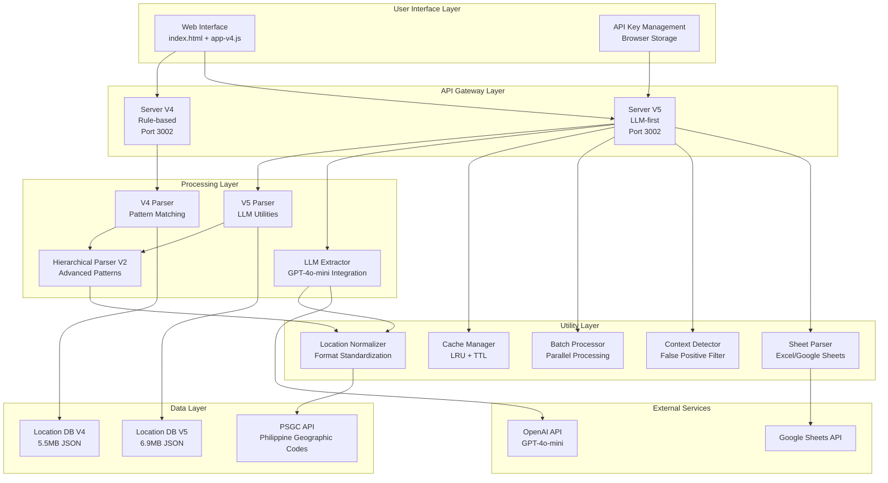
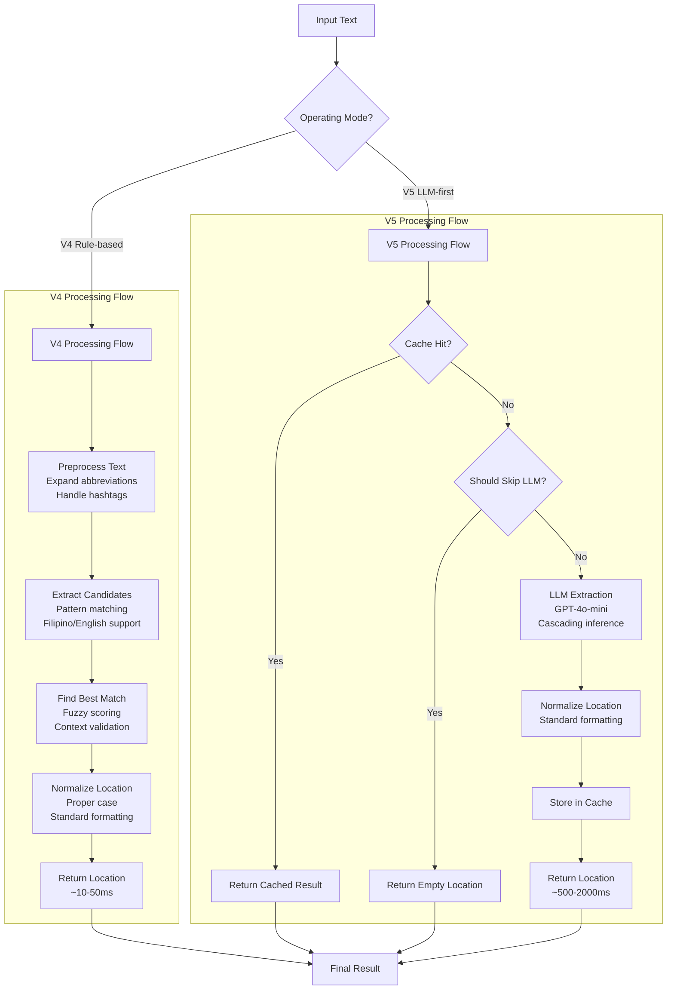
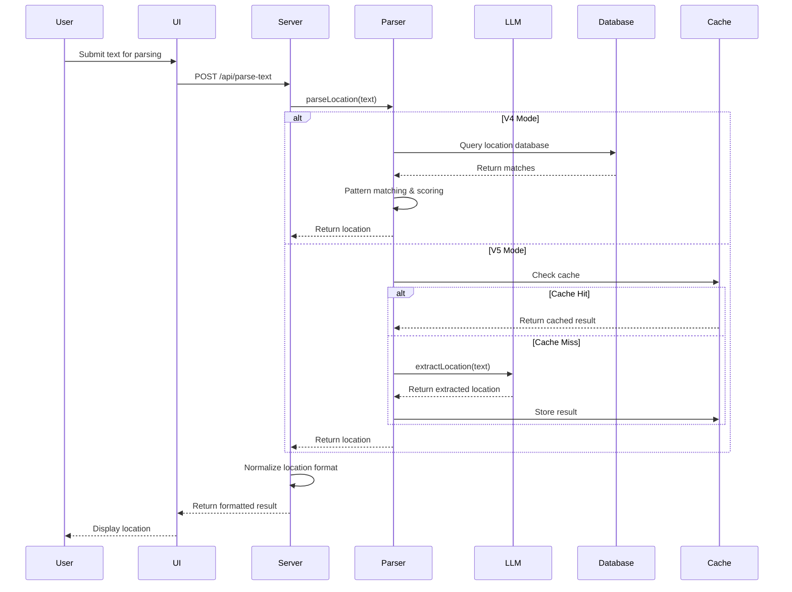
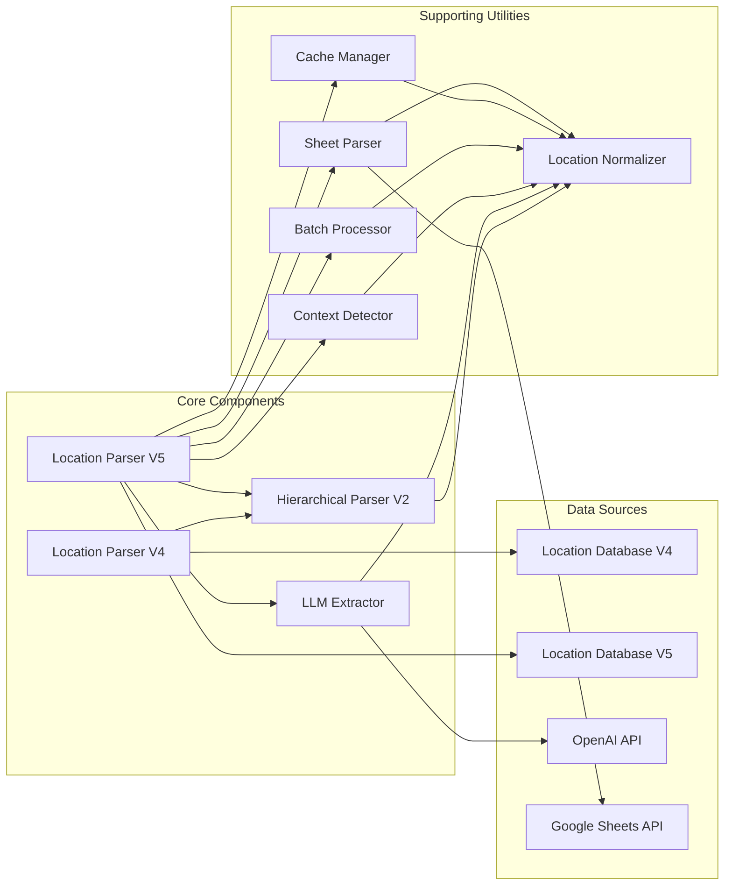
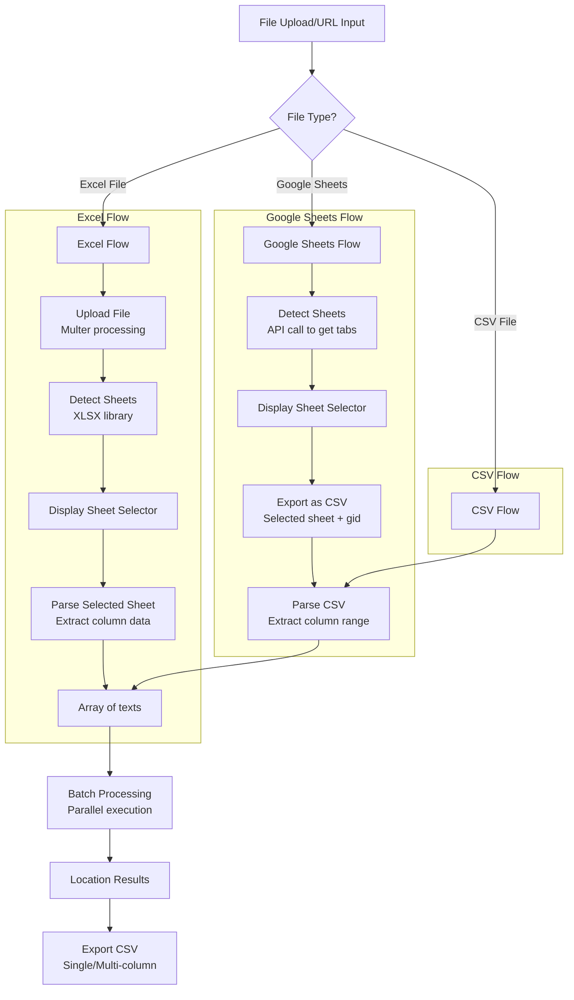
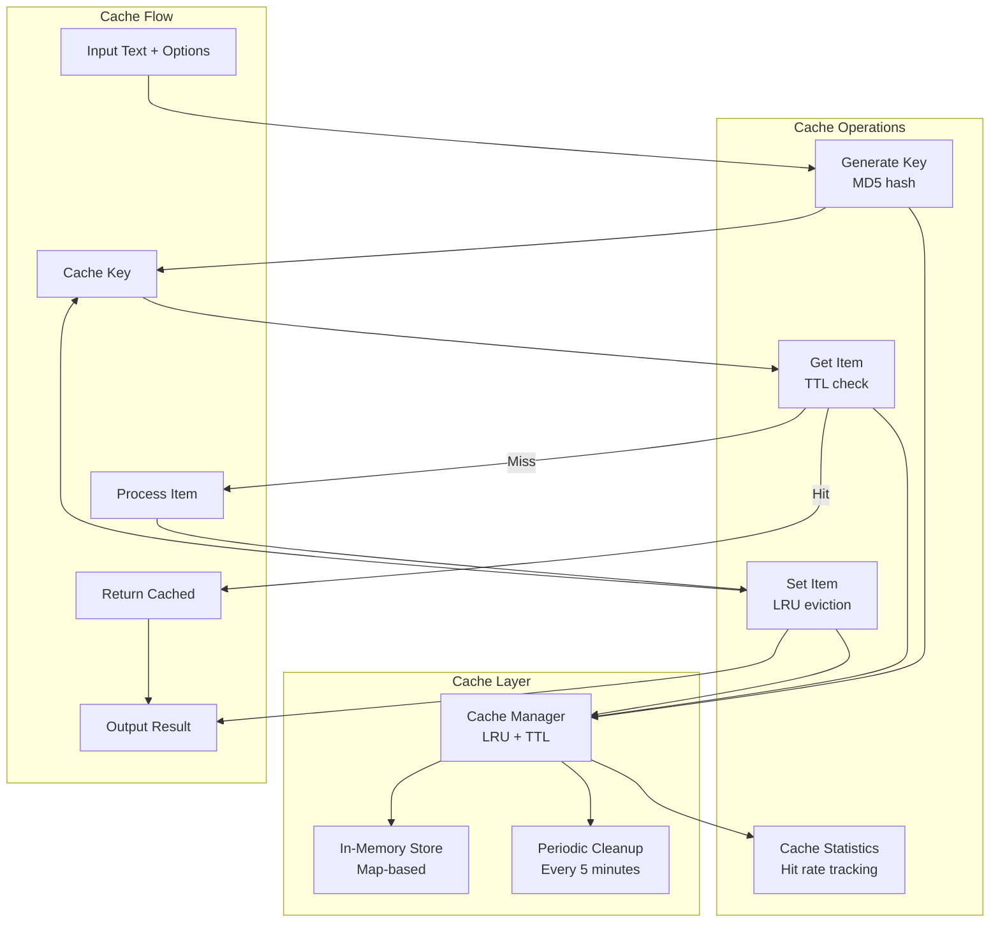
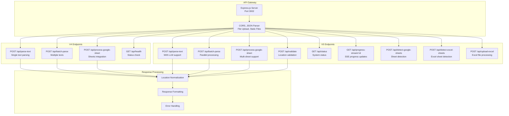
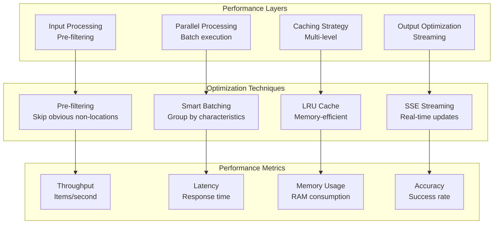
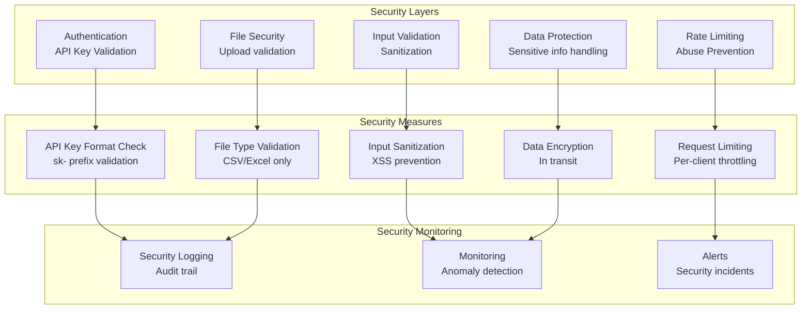

# Philippine Location Parser - Architectural Diagrams

## System Architecture Overview

## Dual-Mode Processing Flow

## Data Flow Architecture

## Component Interaction Diagram

## Multi-Sheet Processing Flow

## Caching Architecture

## API Endpoint Architecture

## Performance Optimization Architecture

## Security Architecture

These diagrams provide a comprehensive visual representation of the Philippine Location Parser's architecture, showing how components interact, data flows through the system, and various optimization strategies are implemented. The dual-mode nature of the system is clearly illustrated, along with the sophisticated caching, processing, and security mechanisms that make it a robust solution for location extraction from Philippine text.