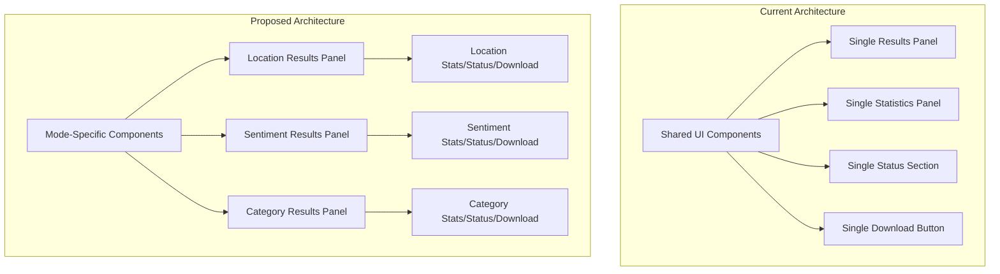
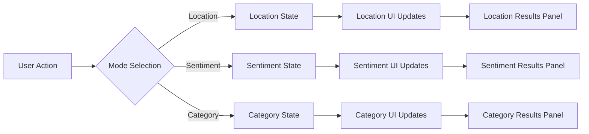
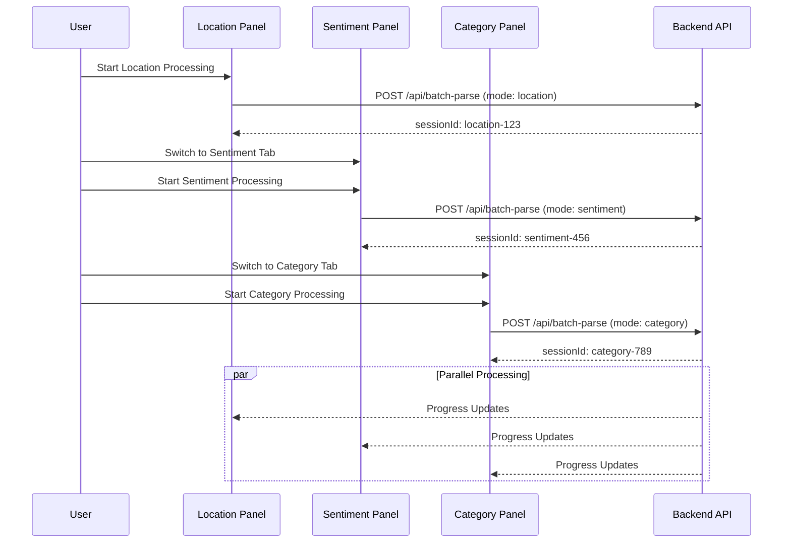

# Concurrent Processing Implementation Guide

## Architecture Diagrams

### Current vs Proposed Architecture



### State Management Flow



### Concurrent Processing Flow



## Detailed Implementation Steps

### Step 1: HTML Structure Changes

#### New HTML Structure for Mode-Specific Panels

```html
<!-- Replace existing single results section with mode-specific panels -->
<div class="mode-results-container" id="modeResultsContainer">
    
    <!-- Location Results Panel -->
    <div class="mode-panel" id="locationPanel">
        <div class="mode-panel-header">
            <h3>
                <svg width="18" height="18" viewBox="0 0 24 24" fill="none" stroke="currentColor" stroke-width="2">
                    <path d="M21 10c0 7-9 13-9 13s-9-6-9-13a9 9 0 0 1 18 0z"></path>
                    <circle cx="12" cy="10" r="3"></circle>
                </svg>
                Location Extraction
                <span class="mode-status-badge" id="locationStatusBadge">Inactive</span>
            </h3>
            <button class="mode-clear-btn" onclick="clearModeResults('location')" style="display:none;">
                Clear Results
            </button>
        </div>
        
        <div class="mode-stats-panel" id="locationStatsPanel">
            <div class="stats-grid">
                <div class="stat-card">
                    <div class="stat-number" id="locationTotalProcessed">0</div>
                    <div class="stat-label">Total Rows</div>
                </div>
                <div class="stat-card">
                    <div class="stat-number" id="locationLocationsFound">0</div>
                    <div class="stat-label">With Locations</div>
                    <div class="stat-percentage" id="locationSuccessRate">0%</div>
                </div>
                <div class="stat-card">
                    <div class="stat-number" id="locationNoLocation">0</div>
                    <div class="stat-label">No Location</div>
                </div>
                <div class="stat-card">
                    <div class="stat-number" id="locationAvgConfidence">-</div>
                    <div class="stat-label">Avg. Confidence</div>
                </div>
            </div>
        </div>
        
        <div class="mode-status-section" id="locationStatusSection">
            <div class="status-header">
                <div class="spinner status-icon" id="locationStatusIcon"></div>
                <h3 id="locationStatusTitle">Ready</h3>
                <span class="processing-time" id="locationProcessingTime"></span>
            </div>
            <div class="progress-bar">
                <div class="progress-fill" id="locationProgressBar" style="width: 0%"></div>
            </div>
            <div class="status-message" id="locationStatusMessage">Ready to process</div>
        </div>
        
        <div class="mode-results-section" id="locationResultsSection"></div>
        
        <div class="mode-download-section" id="locationDownloadSection" style="display:none;">
            <div class="download-options">
                <label style="font-weight: 600; color: #333; margin-bottom: 10px; display: block;">
                    Export Format:
                </label>
                <div style="display: flex; gap: 20px; margin-bottom: 15px;">
                    <label style="display: flex; align-items: center; cursor: pointer;">
                        <input type="radio" name="locationExportFormat" value="single" checked style="margin-right: 8px;">
                        <span>Single Column</span>
                    </label>
                    <label style="display: flex; align-items: center; cursor: pointer;">
                        <input type="radio" name="locationExportFormat" value="multiple" style="margin-right: 8px;">
                        <span>Multiple Columns</span>
                    </label>
                </div>
            </div>
            <button class="btn-primary" onclick="downloadModeCSV('location')" style="background: linear-gradient(135deg, #28a745 0%, #20c997 100%);">
                Download Location Results
            </button>
        </div>
    </div>
    
    <!-- Sentiment Results Panel -->
    <div class="mode-panel" id="sentimentPanel">
        <div class="mode-panel-header">
            <h3>
                <svg width="18" height="18" viewBox="0 0 24 24" fill="none" stroke="currentColor" stroke-width="2">
                    <circle cx="12" cy="12" r="10"></circle>
                    <path d="M8 14s1.5 2 4 2 4-2 4-2"></path>
                    <line x1="9" y1="9" x2="9.01" y2="9"></line>
                    <line x1="15" y1="9" x2="15.01" y2="9"></line>
                </svg>
                Sentiment Classification
                <span class="mode-status-badge" id="sentimentStatusBadge">Inactive</span>
            </h3>
            <button class="mode-clear-btn" onclick="clearModeResults('sentiment')" style="display:none;">
                Clear Results
            </button>
        </div>
        
        <div class="mode-stats-panel" id="sentimentStatsPanel">
            <div class="stats-grid">
                <div class="stat-card">
                    <div class="stat-number" id="sentimentTotalProcessed">0</div>
                    <div class="stat-label">Total Rows</div>
                </div>
                <div class="stat-card">
                    <div class="stat-number" id="sentimentClassified">0</div>
                    <div class="stat-label">Classified</div>
                    <div class="stat-percentage" id="sentimentSuccessRate">0%</div>
                </div>
                <div class="stat-card">
                    <div class="stat-number" id="sentimentNotClassified">0</div>
                    <div class="stat-label">Not Classified</div>
                </div>
                <div class="stat-card">
                    <div class="stat-number" id="sentimentAvgConfidence">-</div>
                    <div class="stat-label">Avg. Confidence</div>
                </div>
            </div>
        </div>
        
        <div class="mode-status-section" id="sentimentStatusSection">
            <div class="status-header">
                <div class="spinner status-icon" id="sentimentStatusIcon"></div>
                <h3 id="sentimentStatusTitle">Ready</h3>
                <span class="processing-time" id="sentimentProcessingTime"></span>
            </div>
            <div class="progress-bar">
                <div class="progress-fill" id="sentimentProgressBar" style="width: 0%"></div>
            </div>
            <div class="status-message" id="sentimentStatusMessage">Ready to process</div>
        </div>
        
        <div class="mode-results-section" id="sentimentResultsSection"></div>
        
        <div class="mode-download-section" id="sentimentDownloadSection" style="display:none;">
            <button class="btn-primary" onclick="downloadModeCSV('sentiment')" style="background: linear-gradient(135deg, #28a745 0%, #20c997 100%);">
                Download Sentiment Results
            </button>
        </div>
    </div>
    
    <!-- Category Results Panel -->
    <div class="mode-panel" id="categoryPanel">
        <div class="mode-panel-header">
            <h3>
                <svg width="18" height="18" viewBox="0 0 24 24" fill="none" stroke="currentColor" stroke-width="2">
                    <path d="M22 19a2 2 0 0 1-2 2H4a2 2 0 0 1-2-2V5a2 2 0 0 1 2-2h5l2 3h9a2 2 0 0 1 2 2z"></path>
                </svg>
                Category Classification
                <span class="mode-status-badge" id="categoryStatusBadge">Inactive</span>
            </h3>
            <button class="mode-clear-btn" onclick="clearModeResults('category')" style="display:none;">
                Clear Results
            </button>
        </div>
        
        <div class="mode-stats-panel" id="categoryStatsPanel">
            <div class="stats-grid">
                <div class="stat-card">
                    <div class="stat-number" id="categoryTotalProcessed">0</div>
                    <div class="stat-label">Total Rows</div>
                </div>
                <div class="stat-card">
                    <div class="stat-number" id="categoryClassified">0</div>
                    <div class="stat-label">Classified</div>
                    <div class="stat-percentage" id="categorySuccessRate">0%</div>
                </div>
                <div class="stat-card">
                    <div class="stat-number" id="categoryNotClassified">0</div>
                    <div class="stat-label">Not Classified</div>
                </div>
                <div class="stat-card">
                    <div class="stat-number" id="categoryAvgConfidence">-</div>
                    <div class="stat-label">Avg. Confidence</div>
                </div>
            </div>
        </div>
        
        <div class="mode-status-section" id="categoryStatusSection">
            <div class="status-header">
                <div class="spinner status-icon" id="categoryStatusIcon"></div>
                <h3 id="categoryStatusTitle">Ready</h3>
                <span class="processing-time" id="categoryProcessingTime"></span>
            </div>
            <div class="progress-bar">
                <div class="progress-fill" id="categoryProgressBar" style="width: 0%"></div>
            </div>
            <div class="status-message" id="categoryStatusMessage">Ready to process</div>
        </div>
        
        <div class="mode-results-section" id="categoryResultsSection"></div>
        
        <div class="mode-download-section" id="categoryDownloadSection" style="display:none;">
            <button class="btn-primary" onclick="downloadModeCSV('category')" style="background: linear-gradient(135deg, #28a745 0%, #20c997 100%);">
                Download Category Results
            </button>
        </div>
    </div>
</div>
```

### Step 2: CSS Implementation

#### New CSS Styles for Mode-Specific Panels

```css
/* Mode Results Container */
.mode-results-container {
    display: grid;
    grid-template-columns: repeat(auto-fit, minmax(400px, 1fr));
    gap: 20px;
    margin-top: 30px;
}

/* Mode Panel Styles */
.mode-panel {
    border: 2px solid #e1e4e8;
    border-radius: 12px;
    overflow: hidden;
    background: white;
    transition: all 0.3s ease;
}

.mode-panel.active {
    border-color: #667eea;
    box-shadow: 0 4px 12px rgba(102, 126, 234, 0.2);
}

.mode-panel.processing {
    border-color: #28a745;
    animation: pulse 2s infinite;
}

.mode-panel.completed {
    border-color: #28a745;
}

.mode-panel.error {
    border-color: #dc3545;
}

@keyframes pulse {
    0% { box-shadow: 0 4px 12px rgba(40, 167, 69, 0.2); }
    50% { box-shadow: 0 4px 20px rgba(40, 167, 69, 0.4); }
    100% { box-shadow: 0 4px 12px rgba(40, 167, 69, 0.2); }
}

/* Mode Panel Header */
.mode-panel-header {
    background: linear-gradient(135deg, #f8f9fa 0%, #e9ecef 100%);
    padding: 15px 20px;
    display: flex;
    justify-content: space-between;
    align-items: center;
    border-bottom: 1px solid #e1e4e8;
}

.mode-panel-header h3 {
    margin: 0;
    display: flex;
    align-items: center;
    gap: 8px;
    font-size: 16px;
    color: #333;
}

.mode-status-badge {
    background: #6c757d;
    color: white;
    padding: 2px 8px;
    border-radius: 12px;
    font-size: 11px;
    font-weight: 600;
    text-transform: uppercase;
}

.mode-status-badge.active {
    background: #28a745;
}

.mode-status-badge.processing {
    background: #007bff;
}

.mode-status-badge.completed {
    background: #28a745;
}

.mode-status-badge.error {
    background: #dc3545;
}

.mode-clear-btn {
    background: #dc3545;
    color: white;
    border: none;
    padding: 6px 12px;
    border-radius: 6px;
    font-size: 12px;
    cursor: pointer;
    transition: background 0.3s;
}

.mode-clear-btn:hover {
    background: #c82333;
}

/* Mode-specific sections */
.mode-stats-panel {
    padding: 20px;
    background: #f8f9fa;
}

.mode-status-section {
    padding: 20px;
    background: white;
    border-bottom: 1px solid #e1e4e8;
}

.mode-results-section {
    max-height: 300px;
    overflow-y: auto;
    padding: 0;
}

.mode-download-section {
    padding: 20px;
    background: #f0f7ff;
    border-top: 1px solid #e1e4e8;
}

/* Processing time display */
.processing-time {
    font-size: 12px;
    color: #666;
    margin-left: auto;
}

/* Responsive Design */
@media (max-width: 768px) {
    .mode-results-container {
        grid-template-columns: 1fr;
        gap: 15px;
    }
    
    .mode-panel {
        min-height: auto;
    }
    
    .mode-panel-header {
        flex-direction: column;
        align-items: flex-start;
        gap: 10px;
    }
    
    .mode-panel-header h3 {
        width: 100%;
        justify-content: space-between;
    }
}

@media (max-width: 480px) {
    .stats-grid {
        grid-template-columns: repeat(2, 1fr) !important;
        gap: 10px;
    }
    
    .stat-card {
        padding: 10px;
    }
    
    .stat-number {
        font-size: 20px;
    }
}
```

### Step 3: JavaScript State Management

#### Global State Object and Management Functions

```javascript
// Global state management for concurrent processing
const modeStates = {
    location: {
        isActive: false,
        isProcessing: false,
        sessionId: null,
        results: [],
        statistics: {},
        progress: 0,
        startTime: null,
        endTime: null,
        eventSource: null
    },
    sentiment: {
        isActive: false,
        isProcessing: false,
        sessionId: null,
        results: [],
        statistics: {},
        progress: 0,
        startTime: null,
        endTime: null,
        eventSource: null
    },
    category: {
        isActive: false,
        isProcessing: false,
        sessionId: null,
        results: [],
        statistics: {},
        progress: 0,
        startTime: null,
        endTime: null,
        eventSource: null
    }
};

/**
 * Initialize mode state
 */
function initializeModeState(mode) {
    if (!modeStates[mode]) {
        console.error(`Unknown mode: ${mode}`);
        return;
    }
    
    modeStates[mode] = {
        isActive: false,
        isProcessing: false,
        sessionId: null,
        results: [],
        statistics: {},
        progress: 0,
        startTime: null,
        endTime: null,
        eventSource: null
    };
    
    updateModeUI(mode);
}

/**
 * Get mode-specific state
 */
function getModeState(mode) {
    return modeStates[mode] || null;
}

/**
 * Update mode state
 */
function setModeState(mode, updates) {
    if (!modeStates[mode]) {
        console.error(`Unknown mode: ${mode}`);
        return;
    }
    
    Object.assign(modeStates[mode], updates);
    updateModeUI(mode);
}

/**
 * Update mode UI based on state
 */
function updateModeUI(mode) {
    const state = modeStates[mode];
    const panel = document.getElementById(`${mode}Panel`);
    const statusBadge = document.getElementById(`${mode}StatusBadge`);
    const clearBtn = document.querySelector(`#${mode}Panel .mode-clear-btn`);
    
    if (!panel || !state) return;
    
    // Update panel classes
    panel.classList.remove('active', 'processing', 'completed', 'error');
    
    if (state.isProcessing) {
        panel.classList.add('processing');
        statusBadge.textContent = 'Processing';
        statusBadge.className = 'mode-status-badge processing';
    } else if (state.isActive && state.results.length > 0) {
        panel.classList.add('completed');
        statusBadge.textContent = 'Completed';
        statusBadge.className = 'mode-status-badge completed';
        clearBtn.style.display = 'block';
    } else if (state.isActive) {
        panel.classList.add('active');
        statusBadge.textContent = 'Active';
        statusBadge.className = 'mode-status-badge active';
    } else {
        statusBadge.textContent = 'Inactive';
        statusBadge.className = 'mode-status-badge';
        clearBtn.style.display = 'none';
    }
    
    // Update processing time
    const timeElement = document.getElementById(`${mode}ProcessingTime`);
    if (timeElement) {
        if (state.startTime && state.isProcessing) {
            const elapsed = Date.now() - state.startTime;
            timeElement.textContent = `Time: ${formatTime(elapsed)}`;
        } else if (state.startTime && state.endTime) {
            const total = state.endTime - state.startTime;
            timeElement.textContent = `Total: ${formatTime(total)}`;
        } else {
            timeElement.textContent = '';
        }
    }
}

/**
 * Format time display
 */
function formatTime(milliseconds) {
    const seconds = Math.floor(milliseconds / 1000);
    const minutes = Math.floor(seconds / 60);
    const remainingSeconds = seconds % 60;
    
    if (minutes > 0) {
        return `${minutes}m ${remainingSeconds}s`;
    } else {
        return `${seconds}s`;
    }
}
```

### Step 4: Updated Processing Functions

#### Mode-Specific Processing Functions

```javascript
/**
 * Process text with mode-specific handling
 */
async function processTextWithMode(mode) {
    // Validate API key
    if (!requireApiKey()) {
        return;
    }
    
    // Validate mode-specific inputs
    const validation = validateClassificationInputs();
    if (!validation.valid) {
        showError(validation.message);
        return;
    }
    
    const textInput = document.getElementById('textInput').value.trim();
    if (!textInput) {
        showError('Please enter some text to process');
        return;
    }
    
    const lines = textInput.split('\n').filter(line => line.trim());
    if (lines.length === 0) {
        showError('Please enter valid text');
        return;
    }
    
    // Initialize mode state
    initializeModeState(mode);
    setModeState(mode, {
        isActive: true,
        isProcessing: true,
        startTime: Date.now(),
        sessionId: `${mode}-${Date.now()}`
    });
    
    // Get mode-specific configuration
    const config = getClassificationConfig();
    const state = getModeState(mode);
    
    // Show mode-specific status
    showModeStatus(mode, 'Initializing processing...', 5);
    
    // Disable processing button for current mode
    const processBtn = document.getElementById('processBtn');
    processBtn.disabled = true;
    
    // Set up SSE connection for this mode
    let eventSource = null;
    try {
        eventSource = new EventSource(`/api/progress-stream/${state.sessionId}`);
        
        eventSource.onmessage = (event) => {
            const data = JSON.parse(event.data);
            
            if (data.type === 'progress') {
                const progress = data.percentage || 0;
                const message = data.currentText ?
                    `Processing: ${data.currentText}` :
                    'Processing data...';
                
                updateModeStatus(mode, message, progress, {
                    current: data.current,
                    total: data.total,
                    estimatedRemaining: data.estimatedRemaining
                });
            } else if (data.type === 'completed') {
                updateModeStatus(mode, 'Processing complete!', 100);
                if (eventSource) {
                    eventSource.close();
                }
            }
        };
        
        eventSource.onerror = (error) => {
            console.error('SSE Error:', error);
            if (eventSource) {
                eventSource.close();
            }
        };
        
        // Call the API with mode-specific configuration
        const response = await fetch('/api/batch-parse', {
            method: 'POST',
            headers: {
                'Content-Type': 'application/json',
            },
            body: JSON.stringify({
                texts: lines,
                useLLM: true,
                sessionId: state.sessionId,
                apiKey: getApiKey(),
                ...config
            })
        });
        
        if (!response.ok) {
            throw new Error('Failed to process text');
        }
        
        const data = await response.json();
        
        // Update mode-specific results
        setModeState(mode, {
            isProcessing: false,
            endTime: Date.now(),
            results: data.results,
            statistics: data
        });
        
        // Display results for this mode
        displayModeResults(mode, data.results);
        updateModeStatistics(mode, data);
        
        // Generate CSV for this mode
        generateModeCSV(mode, data.results);
        
        // Show download button for this mode
        document.getElementById(`${mode}DownloadSection`).style.display = 'block';
        
    } catch (error) {
        console.error(`Error processing ${mode}:`, error);
        setModeState(mode, {
            isProcessing: false,
            endTime: Date.now()
        });
        
        updateModeStatus(mode, `Error: ${error.message}`, 0);
        showError(`Error processing ${mode}: ${error.message}`);
    } finally {
        processBtn.disabled = false;
        if (eventSource) {
            eventSource.close();
        }
    }
}

/**
 * Show mode-specific status
 */
function showModeStatus(mode, message, progress) {
    const statusSection = document.getElementById(`${mode}StatusSection`);
    const statusTitle = document.getElementById(`${mode}StatusTitle`);
    const statusIcon = document.getElementById(`${mode}StatusIcon`);
    const progressBar = document.getElementById(`${mode}ProgressBar`);
    const statusMessage = document.getElementById(`${mode}StatusMessage`);
    
    statusSection.classList.add('active');
    statusTitle.textContent = 'Processing...';
    statusIcon.className = 'spinner status-icon';
    progressBar.style.width = progress + '%';
    statusMessage.textContent = message;
}

/**
 * Update mode-specific status
 */
function updateModeStatus(mode, message, progress, details = {}) {
    const statusMessage = document.getElementById(`${mode}StatusMessage`);
    const progressBar = document.getElementById(`${mode}ProgressBar`);
    const statusTitle = document.getElementById(`${mode}StatusTitle`);
    const statusIcon = document.getElementById(`${mode}StatusIcon`);
    
    statusMessage.textContent = message;
    progressBar.style.width = progress + '%';
    progressBar.style.transition = 'width 0.3s ease';
    
    if (details.current && details.total) {
        if (details.estimatedRemaining) {
            statusMessage.innerHTML = `${message}<br><small style="opacity:0.8">Processing ${details.current}/${details.total} items • ~${details.estimatedRemaining}s remaining</small>`;
        } else {
            statusMessage.innerHTML = `${message}<br><small style="opacity:0.8">Processing ${details.current}/${details.total} items</small>`;
        }
    }
    
    if (progress === 100) {
        statusIcon.classList.remove('spinner');
        statusIcon.innerHTML = '✅';
        statusTitle.textContent = 'Complete!';
        progressBar.style.background = '#28a745';
    }
}
```

This implementation guide provides the foundation for supporting concurrent processing with mode-specific UI components. The next steps would be to implement the remaining functions and test the complete workflow.